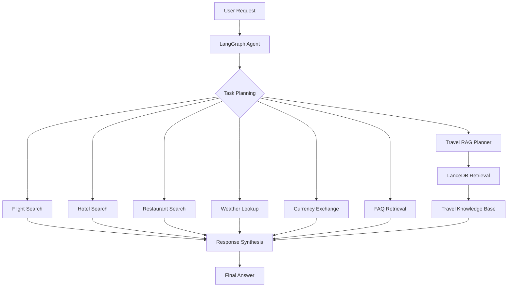

<div align="center">


</div>

---

# Agentic Travel Planning Assistant with LangGraph, RAG, and Real-Time Travel Intelligence

The project demonstrates how autonomous agents can orchestrate multiple travel services, retrieval systems, and external APIs to provide grounded travel recommendations, itinerary generation, and real-time travel intelligence through a unified Agentic AI workflow.

<div align="left">

[](https://www.python.org/)
[](https://www.langchain.com/langgraph)
[](https://www.langchain.com/)
[](https://openai.com/)
[](https://lancedb.github.io/lancedb/)
[](https://developers.amadeus.com/)
[](https://tavily.com/)
[](#)
[](https://opensource.org/licenses/MIT)

</div>

## Abstract

Travel planning often requires users to navigate multiple disconnected services for flights, hotels, local attractions, restaurants, weather conditions, and travel regulations.

This project introduces an Agentic AI Travel Assistant that combines LangGraph-based orchestration, ReAct reasoning, Retrieval-Augmented Generation (RAG), and real-time travel APIs to automate the travel planning process.

The system dynamically selects tools, retrieves travel knowledge from vector databases, integrates external travel services, and generates grounded recommendations and personalized itineraries.

## Table of Contents

1. Overview
2. Key Features
3. Agent Workflow
4. Travel Knowledge Retrieval
5. Tools and Services
6. Project Structure
7. Installation
8. Environment Variables
9. Running the Application
10. Contributing
11. License
12. Author
13. Support

# 📌 Overview

TravelBot is an intelligent travel planning assistant built with Agentic AI principles.

Instead of relying on a single LLM response, the system uses a LangGraph-powered workflow capable of selecting tools, retrieving external knowledge, and coordinating multiple travel services before generating a final answer.

Core capabilities include:

* Flight Search
* Hotel Discovery
* Restaurant Recommendations
* Weather Forecasting
* Currency Exchange Lookup
* Travel FAQ Question Answering
* Knowledge-Grounded Trip Planning

---

# 🎯 Key Features

* Agentic AI with LangGraph
* ReAct-Based Tool Calling
* Retrieval-Augmented Generation (RAG)
* Real-Time Flight Search
* Hotel Recommendation System
* Restaurant Discovery
* Weather Intelligence
* Currency Conversion Support
* Personalized Itinerary Generation
* Travel Knowledge Base Retrieval

---

# Agent Workflow



---

# 📚 Travel Knowledge Retrieval

The system uses Retrieval-Augmented Generation (RAG) to provide grounded travel recommendations.

Knowledge sources include:

* Travel Guide Books
* Destination Information
* Travel FAQs
* Airport Metadata
* Currency Datasets

The retrieval layer is powered by:

```python
SentenceTransformers
+
LanceDB
```

allowing semantic search over travel-related knowledge sources.

---

# 🔧 Tools and Services

| Component            | Purpose                         |
| -------------------- | ------------------------------- |
| LangGraph            | Agent Orchestration             |
| OpenAI GPT-4o-mini   | Reasoning & Response Generation |
| LanceDB              | Vector Storage                  |
| Amadeus API          | Flight & Travel Services        |
| Tavily Search        | Real-Time Travel Information    |
| SentenceTransformers | Embeddings                      |
| LlamaParse           | Travel Document Parsing         |

---

# 📁 Project Structure

```text
Agentic-TravelBot
│
├── travelbot_agent.py
│
├── data/
│   ├── airports.csv
│   ├── currencies.csv
│   ├── faq_dataset.json
│   └── travel_guide.pdf
│
├── vectordb/
│   ├── faq_db/
│   └── travel_db/
│
├── notebooks/
│   └── experiments.ipynb
│
├── requirements.txt
│
└── README.md
```

---

# 🚀 Installation

## Clone Repository

```bash
git clone https://github.com/farzadjannati/Agentic-TravelBot.git

cd Agentic-TravelBot
```

## Create Environment

```bash
conda create -n travelbot python=3.10

conda activate travelbot
```

## Install Dependencies

```bash
pip install -r requirements.txt
```

---

# 🔑 Environment Variables

Create a `.env` file:

```env
OPENAI_API_KEY=YOUR_OPENAI_API_KEY

TAVILY_API_KEY=YOUR_API_KEY

AMADEUS_CLIENT_ID=YOUR_CLIENT_ID

AMADEUS_CLIENT_SECRET=YOUR_CLIENT_SECRET

LLAMA_CLOUD_API_KEY=YOUR_API_KEY
```

---

# ▶ Running the Application

```bash
python travelbot_agent.py
```

---

# 🤝 Contributing

Contributions are welcome.

Feel free to:

* Open Issues
* Submit Pull Requests
* Suggest Improvements
* Report Bugs

---

# License

This project is licensed under the MIT License.

---

## Author

**Farzad Jannati**

M.Sc. Student, University of Tehran

Research Assistant @ Social Networks Lab

**Research Interests:** NLP, Large Language Models (LLMs), Agentic AI, Retrieval-Augmented Generation (RAG), Information Retrieval

📧 [farzadjannati@ut.ac.ir](mailto:farzadjannati@ut.ac.ir)

---

# ⭐ Support

If you find this project useful, consider giving it a star ⭐

---

<p align="center">

Built with ❤️ using LangGraph, OpenAI, LanceDB, Tavily and Amadeus

</p>
