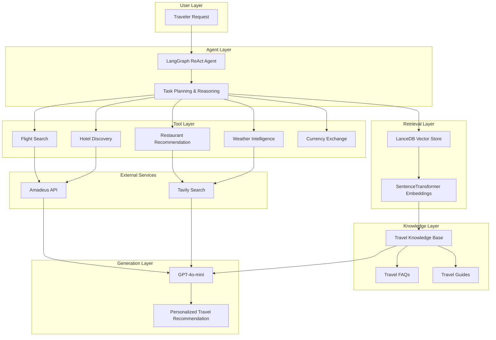
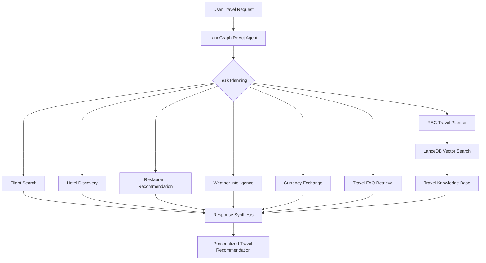

<div align="center">

</div>

---

# Agentic Travel Planning Assistant with LangGraph, RAG, and Real-Time Travel Intelligence

The project demonstrates how autonomous agents can orchestrate multiple travel services, retrieval systems, and external APIs to provide grounded travel recommendations, itinerary generation, and real-time travel intelligence through a unified Agentic AI workflow.

<div align="left">

[](https://www.python.org/)
[](https://www.langchain.com/langgraph)
[](https://www.langchain.com/)
[](https://openai.com/)
[](https://huggingface.co/)
[](https://lancedb.github.io/lancedb/)
[](https://cloud.llamaindex.ai/parse)
[](https://developers.amadeus.com/)
[](https://tavily.com/)
[](https://opensource.org/licenses/MIT)
</div>

## Abstract

Travel planning typically requires users to interact with multiple disconnected services for transportation, accommodation, destination discovery, weather forecasting, and travel regulations.

This project introduces an Agentic AI Travel Assistant that combines LangGraph orchestration, ReAct reasoning, Retrieval-Augmented Generation (RAG), vector search, and real-time travel APIs to automate the travel planning process. The system dynamically selects tools, retrieves destination knowledge, integrates external travel services, and generates grounded recommendations and personalized travel itineraries.

## Table of Contents

1. [Overview](#-overview)
2. [Key Features](#-key-features)
3. [System Architecture](#-system-architecture)
4. [Agent Workflow](#agent-workflow)
5. [Travel Knowledge Retrieval](#-travel-knowledge-retrieval)
6. [Tools and Technologies](#-tools-and-technologies)
7. [Project Structure](#-project-structure)
8. [Installation](#-installation)
9. [Environment Variables](#-environment-variables)
10. [License](#license)
11. [Author](#author)
12. [Support](#-support)

# 📌 Overview

TravelBot is an intelligent travel planning assistant built with Agentic AI principles.

Instead of relying on a single LLM response, the system uses a LangGraph-powered workflow capable of selecting tools, retrieving external knowledge, and coordinating multiple travel services before generating a final answer.

Core capabilities include:

* Flight Search
* Hotel Discovery
* Restaurant Recommendations
* Weather Forecasting
* Currency Exchange Lookup
* Travel FAQ Question Answering
* Knowledge-Grounded Trip Planning

---

# 🎯 Key Features

* Agentic AI powered by LangGraph
* ReAct-based tool orchestration
* Retrieval-Augmented Generation (RAG)
* Flight search integration
* Hotel discovery and recommendation
* Restaurant recommendation
* Weather intelligence retrieval
* Currency exchange lookup
* Travel FAQ retrieval
* Personalized itinerary generation
* Knowledge-grounded travel planning

---

# System Architecture

The system follows a layered Agentic AI architecture that combines autonomous reasoning, retrieval-augmented generation (RAG), vector search, and real-time travel services within a unified orchestration framework.

The LangGraph agent acts as the central decision-making component, dynamically selecting tools, retrieving travel knowledge, and synthesizing information from multiple sources before generating the final recommendation.



### Architectural Components

| Layer | Responsibility |
|---------|---------------|
| Agent Layer | Task decomposition, reasoning, and tool orchestration |
| Tool Layer | Execution of travel-related actions and API calls |
| Retrieval Layer | Semantic retrieval over travel knowledge |
| Knowledge Layer | FAQs, travel guides, and destination information |
| External Services | Real-time travel and web intelligence |
| Generation Layer | Response synthesis and itinerary generation |

This architecture enables the assistant to combine real-time travel information with retrieved domain knowledge, resulting in more grounded recommendations, better planning capabilities, and reduced hallucinations compared to standalone LLM-based travel assistants.

# Agent Workflow



---

# 📚 Travel Knowledge Retrieval

The itinerary generation module is powered by Retrieval-Augmented Generation (RAG).

Instead of relying solely on the language model’s internal knowledge, the system retrieves relevant travel information from a dedicated travel knowledge base before generating recommendations.

Benefits include:

* More grounded travel suggestions
* Reduced hallucinations
* Better destination awareness
* Knowledge-based itinerary generation

The retrieval layer is implemented using:

```python
SentenceTransformers
+
LanceDB
```

---

# Tools and Technologies

| Component            | Purpose                         |
| -------------------- | ------------------------------- |
| LangGraph            | Agent Orchestration             |
| GPT-4o-mini          | Reasoning & Response Generation |
| LanceDB              | Vector Storage                  |
| SentenceTransformers | Embedding Generation            |
| Amadeus API          | Travel Services                 |
| Tavily Search        | Real-Time Information Retrieval |
| LlamaParse           | Travel Document Parsing         |

---

# 📁 Project Structure

```text
Agentic-Travel-Planning-Assistant-with-Real-Time-Travel-Intelligence
│
├── travelbot_agent.ipynb
│
├── data/
│   ├── airports.csv
│   ├── currencies.csv
│   ├── faq_dataset.json
│   └── travel_guide.pdf
│
├── vectordb/
│   ├── faq_db/
│   └── travel_db/
│
├── requirements.txt
│
└── README.md
```

---

# 🚀 Installation

## Clone Repository

```bash
git clone https://github.com/farzadjannati/Agentic-Travel-Planning-Assistant-with-Real-Time-Travel-Intelligence.git

cd Agentic-Travel-Planning-Assistant-with-Real-Time-Travel-Intelligence
```

## Create Environment

```bash
conda create -n travelbot python=3.10

conda activate travelbot
```

## Install Dependencies

```bash
pip install -r requirements.txt
```

---

# 🔑 Environment Variables

Create a `.env` file:

```env
OPENAI_API_KEY=YOUR_OPENAI_API_KEY

TAVILY_API_KEY=YOUR_API_KEY

AMADEUS_CLIENT_ID=YOUR_CLIENT_ID

AMADEUS_CLIENT_SECRET=YOUR_CLIENT_SECRET

LLAMA_CLOUD_API_KEY=YOUR_API_KEY
```

---

# License

This project is licensed under the MIT License.

---

## Author

**Farzad Jannati**

M.Sc. Student, University of Tehran

Research Assistant @ Social Networks Lab

**Research Interests:** NLP, Large Language Models (LLMs), Agentic AI, Retrieval-Augmented Generation (RAG), Information Retrieval

📧 [farzadjannati@ut.ac.ir](mailto:farzadjannati@ut.ac.ir) | 💻 [github.com/farzadjannati](https://github.com/farzadjannati) | 💼 [linkedin.com/in/farzadjannati](https://www.linkedin.com/in/farzadjannati)

---

# ⭐ Support

If you find this project useful, consider giving it a star ⭐

---

<p align="center">

Built with ❤️ using LangGraph, OpenAI, LanceDB, Tavily, Amadeus

</p>
