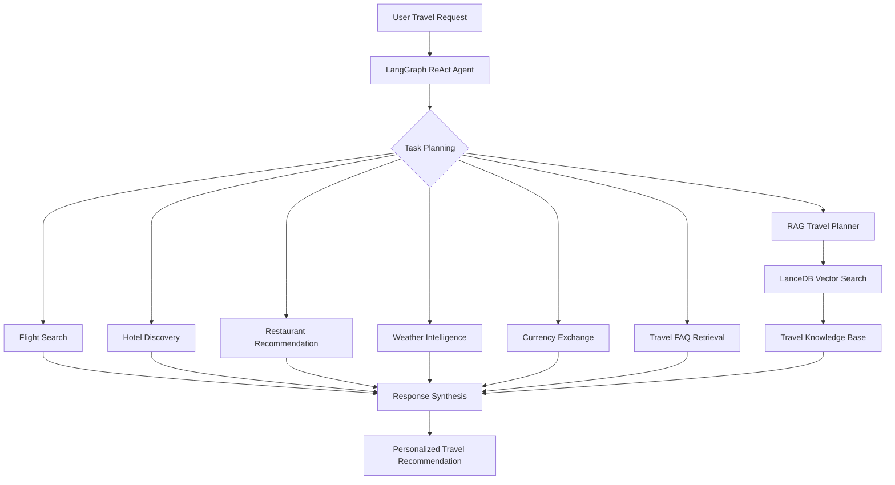

<div align="center">


</div>

---

# Agentic Travel Planning Assistant with Real-Time Travel Intelligence

The project demonstrates how Agentic AI systems can orchestrate retrieval pipelines, external travel services, and real-time information sources to automate end-to-end travel planning through a unified LangGraph-based workflow.

<div align="left">

[](https://www.python.org/)
[](https://www.langchain.com/langgraph)
[](https://www.langchain.com/)
[](https://openai.com/)
[](https://lancedb.github.io/lancedb/)
[](#)
[](#)
[](https://opensource.org/licenses/MIT)

</div>

## Abstract

Travel planning typically requires users to interact with multiple disconnected services for transportation, accommodation, destination discovery, weather forecasting, and travel regulations.

This project introduces an Agentic AI Travel Assistant that combines LangGraph orchestration, ReAct reasoning, Retrieval-Augmented Generation (RAG), vector search, and real-time travel APIs to automate the travel planning process. The system dynamically selects tools, retrieves destination knowledge, integrates external travel services, and generates grounded recommendations and personalized travel itineraries.

## Table of Contents

1. [Overview](#-overview)
2. [Key Features](#-key-features)
3. [System Architecture](#-system-architecture)
4. [Why Agentic AI?](#-why-agentic-ai)
5. [Agent Workflow](#agent-workflow)
6. [Travel Knowledge Retrieval](#-travel-knowledge-retrieval)
7. [Tools and Technologies](#-tools-and-technologies)
8. [Project Structure](#-project-structure)
9. [Installation](#-installation)
10. [Environment Variables](#-environment-variables)
11. [Running the Application](#-running-the-application)
12. [Contributing](#-contributing)
13. [License](#license)
14. [Author](#author)
15. [Support](#-support)

# 📌 Overview

Large Language Models alone are often insufficient for complex travel planning tasks because they cannot reliably access real-time information or coordinate multiple travel services.

This project introduces an Agentic AI architecture capable of:

* Planning multi-step travel tasks
* Retrieving destination knowledge
* Accessing external travel services
* Combining multiple information sources
* Generating personalized travel recommendations

The result is a travel intelligence system capable of delivering more grounded, actionable, and context-aware responses.

---

# 🎯 Key Features

* Agentic AI powered by LangGraph
* ReAct-based tool orchestration
* Retrieval-Augmented Generation (RAG)
* Flight search integration
* Hotel discovery and recommendation
* Restaurant recommendation
* Weather intelligence retrieval
* Currency exchange lookup
* Travel FAQ retrieval
* Personalized itinerary generation
* Knowledge-grounded travel planning

---

# 🏗 System Architecture

The system combines agentic reasoning, retrieval-augmented generation, vector search, and external travel APIs within a unified orchestration framework.

Core layers include:

* Agent Layer (LangGraph + ReAct)
* Tool Execution Layer
* Retrieval Layer (LanceDB)
* Travel Knowledge Layer
* External Travel APIs
* Response Generation Layer

This architecture enables dynamic planning, autonomous tool selection, knowledge retrieval, and grounded response generation.

---

# 🤖 Why Agentic AI?

Traditional travel assistants rely on a single LLM response, limiting their ability to access external information and perform multi-step planning.

This project adopts an Agentic AI architecture that enables:

* Dynamic tool selection
* Multi-step reasoning
* Autonomous planning
* Knowledge-grounded generation
* Real-time information retrieval

As a result, the assistant can coordinate multiple travel services and generate more reliable recommendations.

---

# Agent Workflow



---

# 📚 Travel Knowledge Retrieval

The itinerary generation module is powered by Retrieval-Augmented Generation (RAG).

Instead of relying solely on the language model’s internal knowledge, the system retrieves relevant travel information from a dedicated travel knowledge base before generating recommendations.

Benefits include:

* More grounded travel suggestions
* Reduced hallucinations
* Better destination awareness
* Knowledge-based itinerary generation

The retrieval layer is implemented using:

```python
SentenceTransformers
+
LanceDB
```

---

# 🔧 Tools and Technologies

| Component            | Purpose                         |
| -------------------- | ------------------------------- |
| LangGraph            | Agent Orchestration             |
| GPT-4o-mini          | Reasoning & Response Generation |
| LanceDB              | Vector Storage                  |
| SentenceTransformers | Embedding Generation            |
| Amadeus API          | Travel Services                 |
| Tavily Search        | Real-Time Information Retrieval |
| LlamaParse           | Travel Document Parsing         |

---

# 📁 Project Structure

```text
Agentic-Travel-Planning-Assistant-with-Real-Time-Travel-Intelligence
│
├── travelbot_agent.ipynb
│
├── data/
│   ├── airports.csv
│   ├── currencies.csv
│   ├── faq_dataset.json
│   └── travel_guide.pdf
│
├── vectordb/
│   ├── faq_db/
│   └── travel_db/
│
├── requirements.txt
│
└── README.md
```

---

# 🚀 Installation

## Clone Repository

```bash
git clone https://github.com/farzadjannati/Agentic-Travel-Planning-Assistant-with-Real-Time-Travel-Intelligence.git

cd Agentic-Travel-Planning-Assistant-with-Real-Time-Travel-Intelligence
```

## Create Environment

```bash
conda create -n travelbot python=3.10

conda activate travelbot
```

## Install Dependencies

```bash
pip install -r requirements.txt
```

---

# 🔑 Environment Variables

Create a `.env` file:

```env
OPENAI_API_KEY=YOUR_OPENAI_API_KEY

TAVILY_API_KEY=YOUR_API_KEY

AMADEUS_CLIENT_ID=YOUR_CLIENT_ID

AMADEUS_CLIENT_SECRET=YOUR_CLIENT_SECRET

LLAMA_CLOUD_API_KEY=YOUR_API_KEY
```

---

# ▶ Running the Application

Open and run:

```text
travelbot_agent.ipynb
```

using Jupyter Notebook or Google Colab.

---

# 🤝 Contributing

Contributions are welcome.

Feel free to:

* Open Issues
* Submit Pull Requests
* Suggest Improvements
* Report Bugs

---

# License

This project is licensed under the MIT License.

---

## Author

**Farzad Jannati**

M.Sc. Student, University of Tehran

Research Assistant @ Social Networks Lab

**Research Interests:** NLP, Large Language Models (LLMs), Agentic AI, Retrieval-Augmented Generation (RAG), Information Retrieval

📧 [farzadjannati@ut.ac.ir](mailto:farzadjannati@ut.ac.ir) | 💻 [github.com/farzadjannati](https://github.com/farzadjannati) | 💼 [linkedin.com/in/farzadjannati](https://www.linkedin.com/in/farzadjannati)

---

# ⭐ Support

If you find this project useful, consider giving it a star ⭐

---

<p align="center">

Built with ❤️ using LangGraph, OpenAI, LanceDB, Tavily, Amadeus and RAG

</p>
